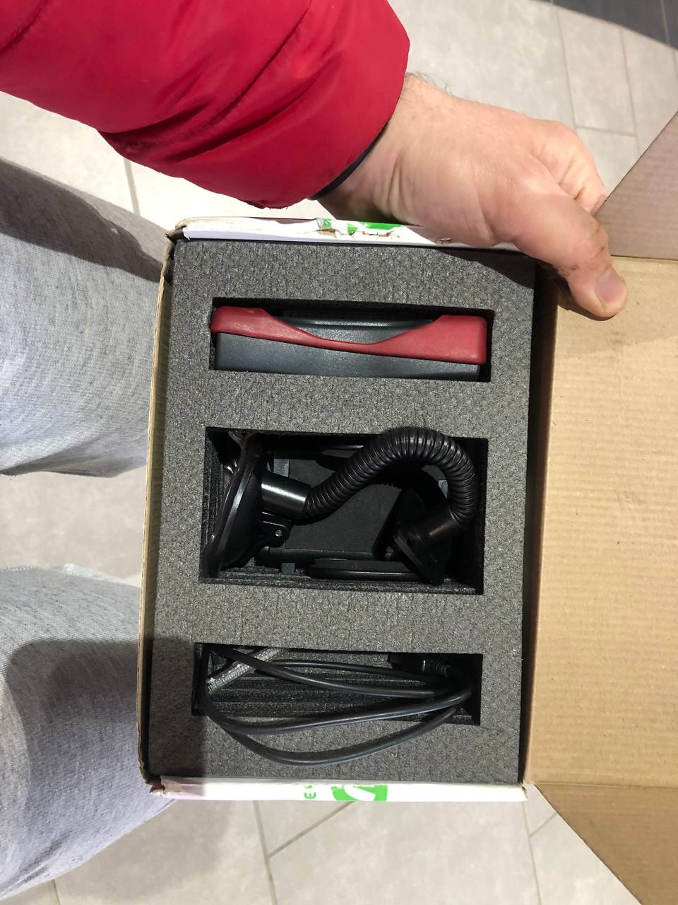
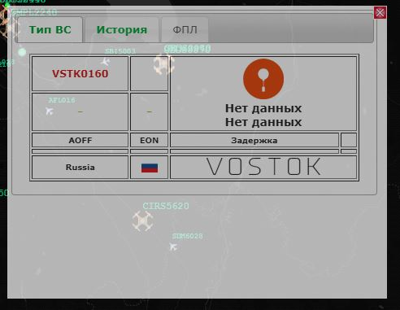
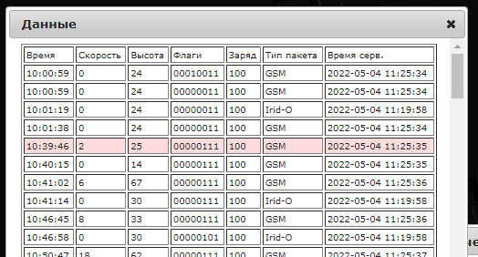
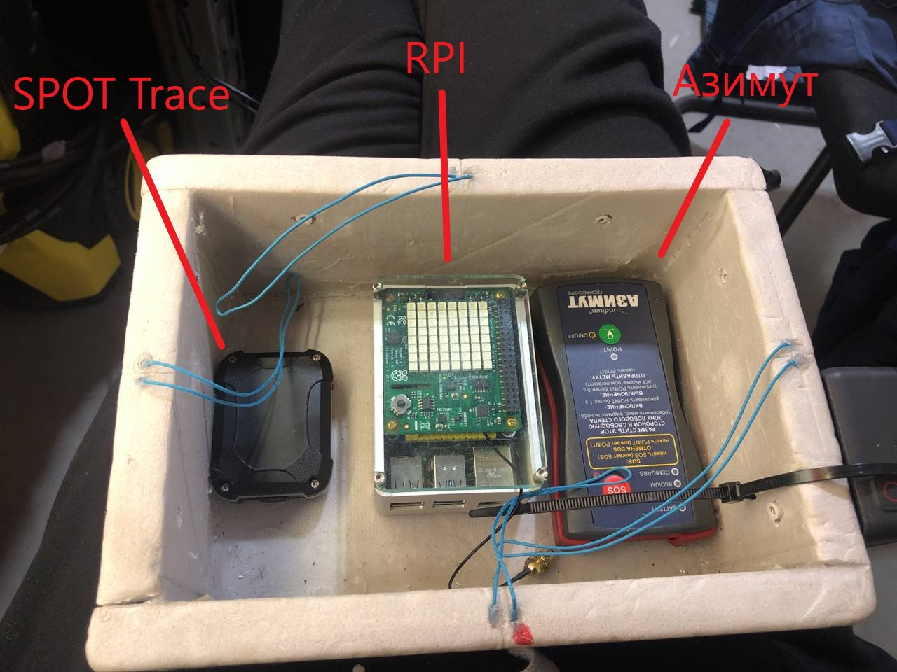
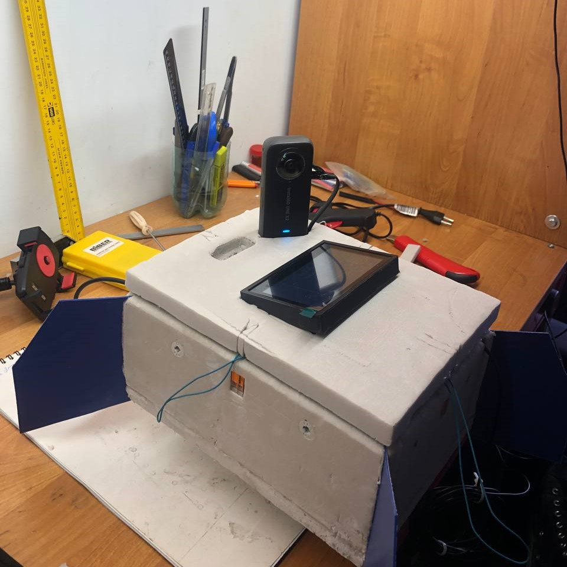
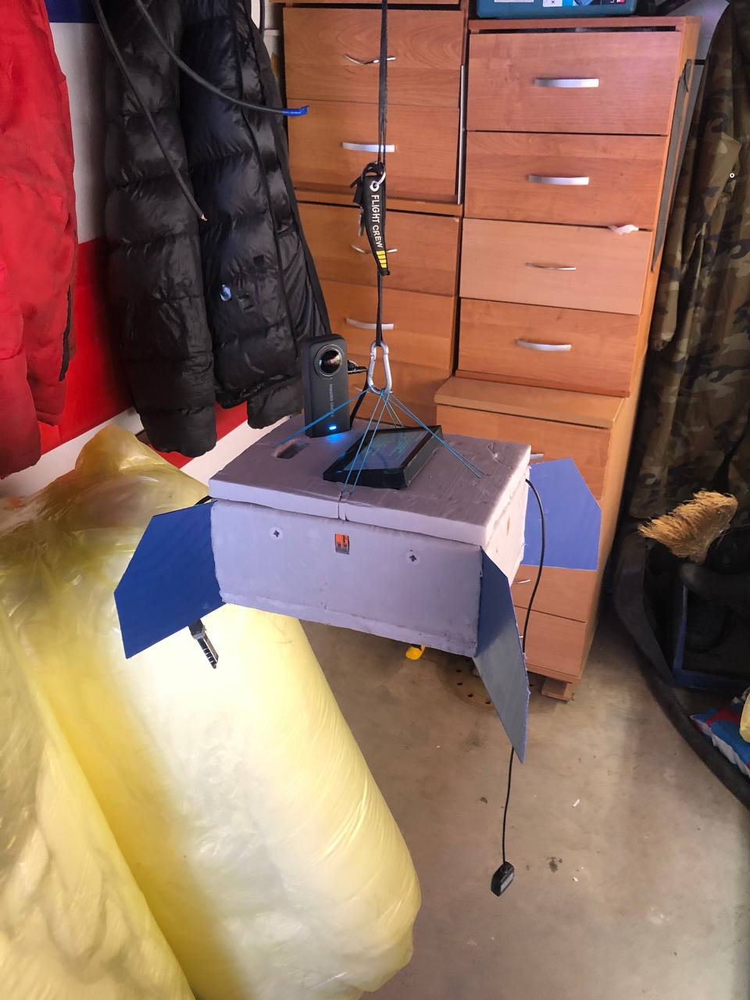
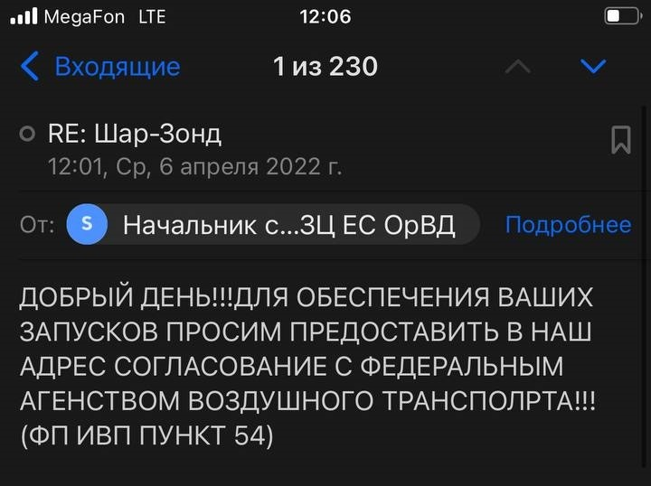
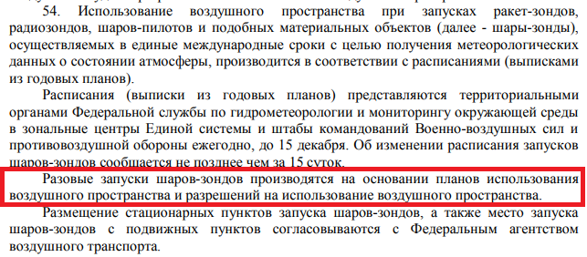

# Самодельный стратостат. Сезон 2022. Часть 1

## Вступление

## Список оборудования и компонентов

## Конструкция

### Полезная нагрузка

#### Трекер
(вроде как у восток-3б, нарисовать схему с новой компоновкой)

Как вы могли заметить по списку оборудования, у нас кое-что добавилось в полезной нагрузке. А именно новый, автономный **поисковый** трекер! Это очень важный момент, на котором хотелось бы заострить внимание, так как это может быть полезно для ваших запусков (в своей первой статье про [Самодельный стратостат](https://habr.com/ru/post/555070/) я объяснил важность этого компонента).

Итак, наш любимый SPOT Trace, служивший нам верой и правдой весь прошлый сезон, начал немного хворать. Нет, он проджолжал присылать координаты, но делать это стал как-то неуверенно и не долго. Батареи садились примерно за неделю (да, мы их меняли и не раз - не помогло). Это все еще очень хороший показатель автономности и новый трекер его не перебивает. Но... захотелось подстраховаться. Таким образом мы выторговали на просторах интернета б\у трекер отечественного бренда - "[Азимут IRIDIUM/GSM](https://www.decima.ru/video_audio/catalog/navigatsionnye_pribory/treker_navigatsionnyy_sputnikovyy_azimut_iridium_gsm/)".

> Мы нашли именно б\у трекер, списаный и снятый с какого-то самолета. Он нам обошелся в 30000 рублей.

Он имеет на борту 2 канала связи для передачи координат: спутниковую сеть IRIDIUM и мобильную сеть GSM. GSM используется когда доступна, в противном случае переходит на спутник. Такое поведение нам очень нравится.

Проблема этого трекера в малой автономности. Заряда встроенного аккумулятора, согласно официальной инструкции, хватает на "десятки часов". Вроде достаточно, но сильно меньше чем у SPOT. С другой стороны, этот недостаток покрывается лучшим охватом и более уверенной связью IRIDIUM. Напомню, что автономность SPOT нас спасала в условиях плохого сигнала (использует спутниуовую инфраструктуру Globalstar), когда трекер молчал **несколько дней** и только потом прорезался сигнал. Чтож, если с сетью все ок, то "десятков часов" нам хватает с запасом.

Тем не менее, в этот запуск мы решили не рисковать *настолько* и **положили в коробку оба трекера** ¯\\_(ツ)/¯

Фото этого чуда и его комплектация:




Следить за его положением вы можете на сайте [flyrf.ru](https://flyrf.ru/). Вверху надо включить отображение АОН/БАС и в поиске ввести наш ID: **VSTK0160**

Должны увидеть что-то вроде:



В истории видно, каким каналом был отправлен трек (поле: Тип пакета):



Ну а дальше разберетесь по кнопкам.

> Небольшое отступление про возможности конфигурации этого устройства. Механика схожа со SPOT Trace: есть десктопная программа, ставите, конфигурируете. Это приложение предоставляет поставщик трекера, через него же (поставщика) идет оплата подписки. Напрямую Iridium (именно их сеть используется как канал передачи данных) платить нельзя - только через посредников (и это не нововведение - это всегда так было, насколько я знаю). На [странице поставщика](https://www.decima.ru/video_audio/catalog/navigatsionnye_pribory/treker_navigatsionnyy_sputnikovyy_azimut_iridium_gsm/) есть тарифная сетка. В опции конфигурации углубляться не буду, иначе этот текст никогда не закончится. Скажу лишь, что мы отключили GSM (в наших местах его все равно нет) и поставили интервал треков в 300 сек в состоянии движения и 3600 сек в покое. С целью экономии батареи.

Таким образом, у нас на борту появилось уже 3 приемника и 2 передатчика координат. Интерференция может насоздавать проблем в таком случае. В документации SPOT есть рекомендация: располагать трекер не ближе 30см от других приемо-передатчиков. Легко сказать, но как это сделать в малюсенькой коробке зонда?

Никак.

Можно конечно поиграться с проводами/выносными мачтами, привязать трекер к стропам/фалу и т.д., но не забываем про температуру и как к ней относятся элементы питания! Есть риск, что снаружи аккумуляторы замерзнут еще на подъеме. Да, они потом отмерзнут и возможно включатся снова. *Возможно*. Ситуация спорная, так что мы решили тупо протестить - включали трекеры рядом друг с другом, носили их по городу в одной сумке и т.п. Результаты нам понравились - оба трекера работали как обычно. Так что было принято решение все же разместить их внутри короба и обеспечить штатным обогревом.

Вот, как они расположились внутри короба:



#### Камера

Второе важное изменение - мы поменяли камеру. Прошлая GoPro 7 Black нас устраивала всем, кроме угла обзора. Очень хотелось посмотреть еще и на шар в полете. Мы даже разрабатывали вариант с 2-я камерами - одна на шар, вторая на горизонт. Но 2 камеры это двойной вес и двойное питание (что опять же - новая масса). Так что мы решили проблему координально - приобрели камеру с обзором 360 градусов! А конкретно [Insta360 One X2](https://www.insta360.com/ru/product/insta360-onex2). Да-да, теперь наши видосы можно смотреть в VR очках. Даже в таких [картонных](https://imcardboard.com/), я лично в таких и смотрю :) Эффект погружения - присутствует.

Теперь эту камеру надо как-то разместить на коробе. Так, чтобы не потерять в полете, чтобы она не перегрелась и чтобы ничто не мешало обзору.

Родился такой план:



Основание немного утоплено в пенопласт (из-за этого пришлось наложить второй слой крышки - чтобы не нарушать термоизоляцию внутренностей) и зафиксировано термоклеем. Основное пятно нагрева у этой камеры в зоне объективов, так что перегреться не должна. Прямой вид на горизонт, а так же на следующее дополнение нашей конструкции.

#### Дисплей

Здесь я, в основном, затрону "железную" часть вопроса и зачем нам вообще понадобился дисплей.

Итак, если вы помните, в прошлом сезоне у нас было 2 источника телеметрии: RPI с GPS HAT + набор сенсоров и GoPro 7. Данные с GoPro позволяли нам легко синхронизировать видео с показаниями RPI (чтобы сделать наложение телеметрии на видео). Это было нам необходимо, так как камера не обладает всеми необходимыми нам датчиками (температур, давления и т.п.). В новой камере такой роскоши нет. Чтобы иметь в метаданных видео показания GPS - нужно использовать специальный отдельный модуль для этой камеры (ну и купить его, соответственно). Питание для этого модуля тоже нужно отдельное. Мда, тут наславу потрудился маркетолог. Нуштош...

Можно было пойти и по пути покупки этого модуля, но мы решили сделать чуть более надежно (и более распространенно в среде запускателей подобных зондов) - добавить в кадр показания самого RPI. Это все так же дополнительная масса и увеличенное энергопотребление, но добавлять новых батарей нам не потребовалось - питания подсистемы телеметрии хватало с запасом и на дисплей.

Плюсом мы исключали полностью необходимость синхронизации телеметрии и видео. А обзор камеры позволял внедрить следующий сценарий использования: в нужный момент останавливаем видео при просмотре и поворачиваем обзор на дисплей. С прошлой камерой такого бы "не прокатило".

Вот [этот дисплей](https://www.waveshare.com/4.3inch-dsi-lcd.htm) мы выбрали. Не очень большой, не очень маленький, с хорошей яркостью, подключается к порту DSI, не требует внешнего питания и есть тач. Зачем тач и почему он не пригодился, я раскажу в разделе про программирование.

> Забавный момент: в комплекте идет шлейф длиной 5см для подключения к RPI. При нашей компоновке этого маловато и мы решили купить что-то длиннее. Забавно тут то, что во всей стране именно эти 15pin FFC шлейфы занесены в красную книгу. Мы с большим трудом нашли последние 10 штук на складе одного магазина и забрали сразу все (цена за штуку там была что-то около 68р). Альтернатива - заказ из Китая. Там они есть, но долго ждать. В итоге у нас появилось 10 15-сантиметровых шлейфов. Должно хватить.

Корпус для него распечатали на 3D-принтере. Я до сих пор не уверен - было ли это хорошее решение, но наш конструктор настоял (основание - возможно долгое пребывание в неблагоприятной среде), а я не возразил. Как по мне, так можно было просто залить там все герметиком, ну да ладно.

Больше изменений "внутри" нет. Посмотрим, что поменялось снаружи.

### Общая конструкция

Принципиально ничего не изменилось аж с самого первого запуска. Так что за подробностями прошу в первую статью. Скажу лишь что в этот раз мы снова использовали латексный шар L-2000 (масса 2000г). Заменили парашют на "побольше" и новый. А в остальном - все так же.



## Программирование

(пофиксили баг с отчетом и пустыми строками, мигрировали на .net6, добавили пару юнит-тестов. все это весело через TeamViewer и SSH)

## CI/CD

Azure Devops. Проблемы с агентом при добавлении Environment (ссылка не на arm агента). Надо найти в настройках -> пулы -> агенты ссылку на arm агента

## Бухгалтерия

(лол кек купили вездеход... новая камера, шар 2000г)

## Подготовка к запуску

Да, тут мы поели "варенья"... Хватило всем!. Для начала о супер-важном.

### Полетный план

Тот крсивый и удобный сайт (new.ivprf.ru), который я рекламировал в прошлом сезоне - закрылся, так до конца и не открывшись. Это очень печальная новость, потому что теперь придется составлять планы "руками" и отправлять их по электронной почте (спасибо, что не факс, хотя на заре наших запусков была и такая история). Но, как оказалось - не все так страшно. Мы это делаем не первый раз и уже имеем шаблон для планов шаров-зондов:

```bash
(SHR-ZZZZZ
-ZZZZ1200
-K0300M3000
-DEP/5850N03325E DOF/220604 OPR/ИВАНОВ ИВАН ИВАНОВИЧ +79001234567 mymail@mail.ru
TYP/SHAR RMK/ОБОЛОЧКА 300 ДЛЯ ЗОНДИРОВАНИЯ АТМОСФЕРЫ SID/VSTK0160)
```

Это **абсолютно полный** полетный план шара-зонда. Именно в таком виде он отправляется в теле письма на почту зональному центру ОрВД.

> Как понять какой у вас зональный центр и куда писать смотрите в [Самодельный стратостат. Полётный план и ОрВД](https://habr.com/ru/post/592383/) или на [сайте ОВД](https://gkovd.ru/services/class-g/). В нашем случае это был СПБ ЗЦ с адресом spbzc@sz.gkovd.ru

Давайте разберем его по косточкам, чтобы вы могли легко адаптировать его под себя.

1. `(SHR-ZZZZZ` Открывающая круглая скобка - начало сообщения. Обязательно. `SHR` - тип сообщения (иногда используется кириллица - СХР). Для шаров-зондов это всегда SHR. `-ZZZZZ` далее через дефис идет рег. номер воздушного судна, если имеется. Если не имеется - 5 букв Z. Самодельному стратостату регистрацию не делают (во всяком случае маложивущему, может для тех кто летает через 12 часовых поясов и делают, но у нас не тот случай)
2. `-ZZZZ1200` Дефис и 4 буквы Z - заглушка для кода аэродрома вылета. Если запускаетесь с аэродрома - тут должен быть код. Мы запускаем по географическим координатам - значит у нас заглушка. `1200` далее без пробелов\дефисов - время вылета по UTC(!)
3. `-K0300M3000` Первая часть K0300 - скороподъемность аппарата в метрах в минуту (впереди лидирующий 0 для фиксации длины сообщения, обязателен). У нас 300 метров в минуту. Вторая часть M3000 - максимальный эшелон полета. Эшелон 3000 соответствует 30000 метров (или 30км). Просто делите свою максимальную ожидаемую высоту на 10 и получите свой эшелон.
4. `-DEP/5850N03325E DOF/220604 OPR/ИВАНОВ ИВАН ИВАНОВИЧ +79001234567 mymail@mail.ru
TYP/SHAR RMK/ОБОЛОЧКА 300 ДЛЯ ЗОНДИРОВАНИЯ АТМОСФЕРЫ SID/VSTK0160)` Да, все в одну строчку, через пробел.
    - `-DEP/5850N03325E` Координаты места запуска. Их формат смотрите в предыдущей статье, ссылка выше.
    - `DOF/220604` дата запуска в формате `YYMMDD`.
    - `OPR/ИВАНОВ ИВАН ИВАНОВИЧ +79001234567 mymail@mail.ru` ФИО и контактные данные (реальные) того кто запускает стратостат. С ним и по этим контактам будет связываться ОрВД и диспетчер запуска.
    - `TYP/SHAR` Тип воздушного судно. Для нас это SHAR.
    - `RMK/ОБОЛОЧКА 300 ДЛЯ ЗОНДИРОВАНИЯ АТМОСФЕРЫ` Примечание в свободной форме. ОрВД просило указывать это - мы указываем.
    - `SID/VSTK0160` Идентификатор сообщения в системе ОрВД. Можно не указывать, они сами присвоят. Мы, зачем-то указали. Но это не обязательно.
    - `)` Зкрывающая скобка - конец сообщения.

Надеюсь все ясно. Да и бОльшую часть информации мы разбирали в прошлой статье. Информация-то на самом деле та же, просто там формы на сайте позволяли вводить ее в более привычном виде. Теперь такой роскоши нет.

**Второй момент**, который может омрачить ваше общение с ЗЦ. Я не хочу обвинять кого-то конкретного, да это и ни к чему, но... Пару раз нам перезванивали и мы слашали в трубке нечко вроде: Ало, это Иван Иваныч? А какого лешего мы должны сопровождать ваши запуски? Вы, вообще, с какого заведения?

При этом на почту они присылают такое:



Чтож... организация большая, государственная. Не лишена структурных "особенностей". Люди работают разные, некоторые - сменами. Так что, даже если вы день назад обо всем договорились, то на следующий день вам может позвонить другой человек и озвучить тот же монолог. Такое случалось.

Ирония заключается в том, что прочитав этот пункт 54 ФП ИВП постановления 138 от 11 марта 2010г (самое свежее на данный момент) по [ссылке на их же сайте](https://gkovd.ru/upload/activities-files/postanovlenie138.pdf), можно найти там такое:



Продублирую текстом: *Разовые запуски шаров-зондов производятся на основании планов использования
воздушного пространства и разрешений на использование воздушного пространства.*

Планы предоставляете вы в ЗЦ ОрВД, а разрешения выдают они вам. Никакого согласования с федеральным агенством воздушного транспорта! Именно такой ответ их удовлетворил и они приняли наши планы, и разрешили запуски. Да, человек на том конце провода взял перерыв на "посоветоваться с начальством", но совет от начальства оказался на нашей стороне. На следующий день история повторилась (возможно пришла новая смена) и мы ее "разрулили" точно так же - упоминанием этого абзаца.

(тут про полетные планы, прогнозирование посадки, пункт 54 постановления и 3 возможные точки запуска. можно упомянуть про промах с ветром тут)

## Запуск

## Поиск и спасение

## Результаты

## Видео

## Выводы

## Ссылки

(оказывается выискивать ссылки в тексе очень не удобно, пусть будут списком еще и тут)

https://ostechnix.com/how-to-change-linux-console-font-type-and-size/
https://raspberrypi.stackexchange.com/a/40144
https://askubuntu.com/a/311454
https://www.simplified.guide/linux/automatically-run-program-on-startup
[запрос на джобы в ажуре для публичных проектов]https://docs.microsoft.com/en-us/azure/devops/pipelines/agents/hosted?view=azure-devops&tabs=yaml#capabilities-and-limitations
[ssh reverse]https://www.howtogeek.com/428413/what-is-reverse-ssh-tunneling-and-how-to-use-it/
[ExecStartPre]https://serverfault.com/a/867845
[SoftRF Config Tool]http://soaringweather.no-ip.info/SoftRF/basic.html
[SoftRF Dongle Settings]https://github.com/lyusupov/SoftRF/wiki/Dongle-settings#windows-pc-or-laptop