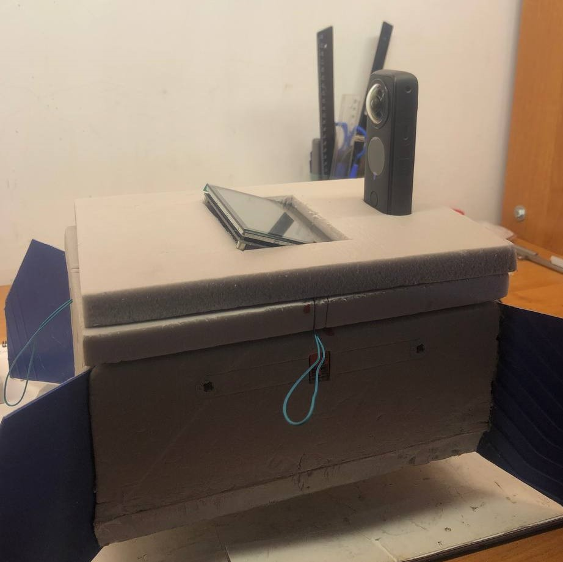

# Самодельный стратостат. Сезон 2022. Часть 1

## Вступление

## Список оборудования и компонентов

## Конструкция

### Полезная нагрузка

#### Трекер
(добавили трекер, дисплей, в остальном вроде как у восток-3б, нарисовать схему с новой компоновкой)

Как вы могли заметить по списку оборудования, у нас кое-что добавилось в полезной нагрузке. А именно новый, автономный **поисковый** трекер! Это очень важный момент, на котором хотелось бы заострить внимание, так как это может быть полезно для ваших запусков (в своей первой статье про [Самодельный стратостат](https://habr.com/ru/post/555070/) я объяснил важность этого компонента).

Итак, наш любимый SPOT Trace, служивший нам верой и правдой весь прошлый сезон, начал немного хворать. Нет, он проджолжал присылать координаты, но делать это стал как-то неуверенно и не долго. Батареи садились примерно за неделю (да, мы их меняли и не раз - не помогло). Это все еще очень хороший показатель автономности и новый трекер его не перебивает. Но... захотелось подстраховаться. Таким образом мы выторговали на просторах интернета б\у трекер отечественного бренда - "[Азимут IRIDIUM/GSM](https://www.decima.ru/video_audio/catalog/navigatsionnye_pribory/treker_navigatsionnyy_sputnikovyy_azimut_iridium_gsm/)".

> Мы нашли именно б\у трекер, списаный и снятый с какого-то самолета. Он нам обошелся в 30000 рублей.

Он имеет на борту 2 канала связи для передачи координат: спутниковую сеть IRIDIUM и мобильную сеть GSM. GSM используется когда доступна, в противном случае переходит на спутник. Такое поведение нам очень нравится.

Проблема этого трекера в малой автономности. Заряда встроенного аккумулятора, согласно официальной инструкции, хватает на "десятки часов". Вроде достаточно, но сильно меньше чем у SPOT. С другой стороны, этот недостаток покрывается лучшим охватом и более уверенной связью IRIDIUM. Напомню, что автономность SPOT нас спасала в условиях плохого сигнала (использует спутниуовую инфраструктуру Globalstar), когда трекер молчал **несколько дней** и только потом прорезался сигнал. Чтож, если с сетью все ок, то "десятков часов" нам хватает с запасом.

Тем не менее, в этот запуск мы решили не рисковать *настолько* и положили в коробку оба трекера ¯\\_(ツ)/¯

Фото этого чуда и его комплектация:

Следить за его положением вы можете на сайте [flyrf.ru](https://flyrf.ru/). Вверху надо включить отображение АОН/БАС и в поиске ввести наш ID: **VSTK0160**

Должны увидеть что-то вроде:

В истории видно, каким каналом был отправлен трек (поле: Тип пакета):

Ну а дальше разберетесь по кнопкам.

Таким образом, у нас на борту появилось уже 3 приемника и 2 передатчика координат. Интерференция может насоздавать проблем в таком случае. В документации SPOT есть рекомендация: располагать трекер не ближе 30см от других приемо-передатчиков. Легко сказать, но как это сделать в малюсенькой коробке зонда?

Никак.

Можно конечно поиграться с проводами/выносными мачтами, привязать трекер к стропам/фалу и т.д., но не забываем про температуру и как к ней относятся элементы питания! Есть риск, что снаружи аккумуляторы замерзнут еще на подъеме. Да, они потом отмерзнут и возможно включатся снова. *Возможно*. Ситуация спорная, так что мы решили тупо протестить - включали трекеры рядом друг с другом, носили их по городу в одной сумке и т.п. Результаты нам понравились - оба трекера работали как обычно. Так что было принято решение все же разместить их внутри короба и обеспечить штатным обогревом.

Вот, как они расположились внутри короба:

#### Камера

Второе важное изменение - мы поменяли камеру. Прошлая GoPro 7 Black нас устраивала всем, кроме угла обзора. Очень хотелось посмотреть еще и на шар в полете. Мы даже разрабатывали вариант с 2-я камерами - одна на шар, вторая на горизонт. Но 2 камеры это двойной вес и двойное питание (что опять же - новая масса). Так что мы решили проблему координально - приобрели камеру с обзором 360 градусов! А конкретно [Insta360 One X2](https://www.insta360.com/ru/product/insta360-onex2). Да-да, теперь наши видосы можно смотреть в VR очках. Даже в таких [картонных](https://imcardboard.com/), я лично в таких и смотрю :) Эффект погружения - присутствует.

Теперь эту камеру надо как-то разместить на коробе. Так, чтобы не потерять в полете, чтобы она не перегрелась и чтобы ничто не мешало обзору.

Родился такой план:

Основание немного утоплено в пенопласт (из-за этого пришлось наложить второй слой крышки - чтобы не нарушать термоизоляцию внутренностей) и зафиксировано термоклеем. Основное пятно нагрева у этой камеры в зоне объективов, так что перегреться не должна. Прямой вид на горизонт, а так же на следующее дополнение нашей конструкции.

#### Дисплей

### Общая конструкция

(ничего не поменялось, как у восток-1, добавить ссылку, стащить оттуда картинку)

## Программирование

(пофиксили баг с отчетом и пустыми строками, мигрировали на .net6, добавили пару юнит-тестов. все это весело через TeamViewer и SSH)

## CI/CD

Azure Devops. Проблемы с агентом при добавлении Environment (ссылка не на arm агента). Надо найти в настройках -> пулы -> агенты ссылку на arm агента

## Бухгалтерия

(лол кек купили вездеход... новая камера, шар 2000г)

## Подготовка к запуску

(тут про полетные планы, прогнозирование посадки, пункт 54 постановления и 3 возможные точки запуска. можно упомянуть про промах с ветром тут)

## Запуск

## Поиск и спасение

## Результаты

## Видео

## Выводы

## Ссылки

(оказывается выискивать ссылки в тексе очень не удобно, пусть будут списком еще и тут)

https://ostechnix.com/how-to-change-linux-console-font-type-and-size/
https://raspberrypi.stackexchange.com/a/40144
https://askubuntu.com/a/311454
https://www.simplified.guide/linux/automatically-run-program-on-startup
[запрос на джобы в ажуре для публичных проектов]https://docs.microsoft.com/en-us/azure/devops/pipelines/agents/hosted?view=azure-devops&tabs=yaml#capabilities-and-limitations
[ssh reverse]https://www.howtogeek.com/428413/what-is-reverse-ssh-tunneling-and-how-to-use-it/
[ExecStartPre]https://serverfault.com/a/867845
[SoftRF Config Tool]http://soaringweather.no-ip.info/SoftRF/basic.html
[SoftRF Dongle Settings]https://github.com/lyusupov/SoftRF/wiki/Dongle-settings#windows-pc-or-laptop