# Самодельный стратостат. Сезон 2022. Vostok-5

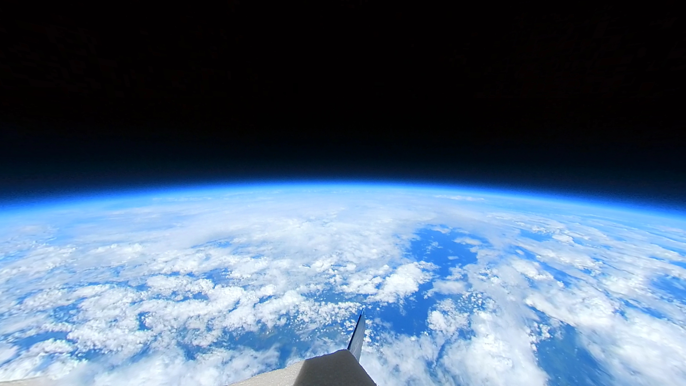

Вот мы и вернулись! С "небольшим" опозданием, но нам есть чем оправдаться ;) В прошлом году мы строили и запускали самодельные стратостаты с целью привезти видео в 4k с высоты 30+ километров. В этом году мы, наконец-то, достигли всех поставленных целей и привезли бескомпромисный результат. Эту версию я подготовил специально для Pikabu - она сильно короче и без технических частей, просто видосы и картинки. Полная версия на Хабре, ссылка будет в конце. Поехали?

## Что нового

Итак, давайте быстренько раскажу, что мы поменяли относительно прошлого сезона:

- Новый поисковый трекер [Азимут IRIDIUM/GSM](https://www.decima.ru/video_audio/catalog/navigatsionnye_pribory/treker_navigatsionnyy_sputnikovyy_azimut_iridium_gsm/)
- Новая камера [Insta360 One X2](https://www.insta360.com/ru/product/insta360-onex2)
- Обновили парашют
- LCD дисплей для отображение телеметрии [Waveshare 4.1inch Touch DSI](https://www.waveshare.com/4.3inch-dsi-lcd.htm)
- ВОДОРОД (азаза, вы просили - мы накачали)

Наш верный SPOT Trace из прошлого сезона начал болеть и мы решили, что пришло время подыскивать ему замену. Мы ее нашли в лице трекера "Азимут" который так же умеет отправлять координаты через спутник и, докучи, через GSM (если она есть):

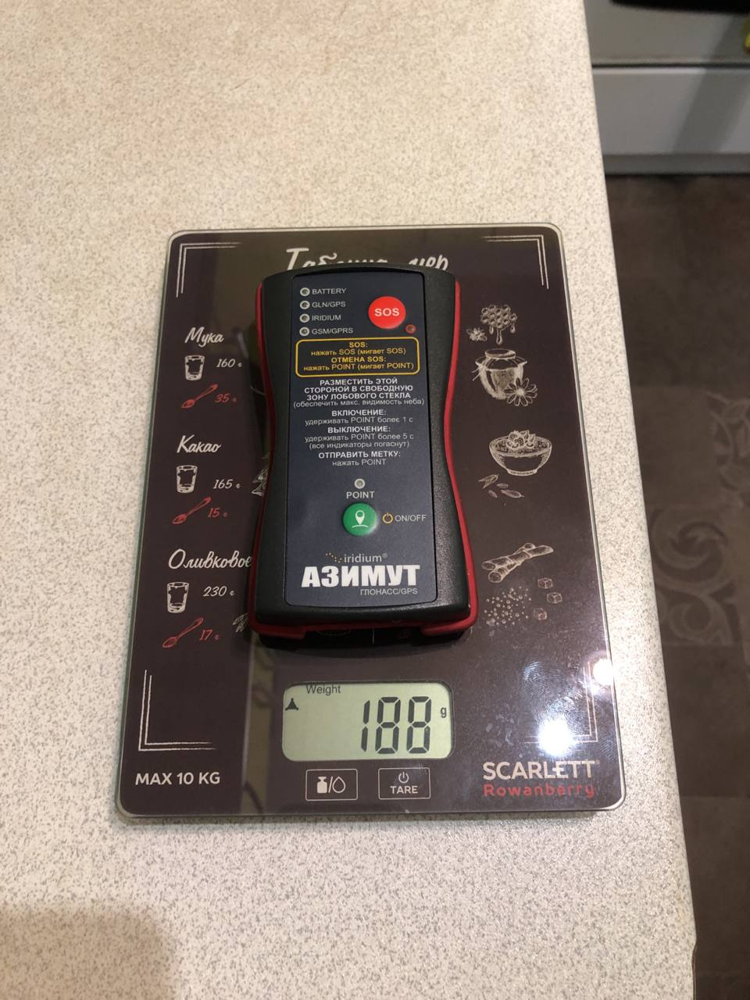

Еще нам очень хотелось посмотреть как взрывается шар, но очень не хотелось цеплять вторую камеру (и дополнительное питание). Так что мы притараканили камеру с обзором 360 градусов и закрыли все наши потребности по этому вопросу. Да-да, это та самая камера, которая:

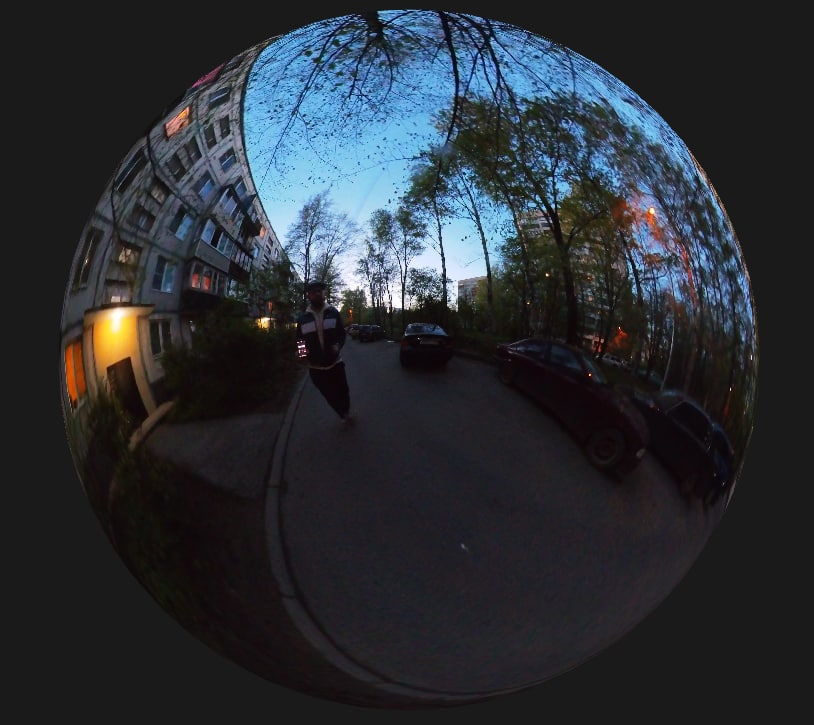

Но не волнуйтесь, на видео такого не будет :)
Благодаря этой камере, вы можете крутить видос в полете куда захотите. Можете даже использовать VR функцию YouTube и смотреть в очках. Например в [картонных](https://imcardboard.com/). Осторожно! Возможны обмороки!

Парашют в этот раз не пригодился, парашют для слабаков. Почему? Потому что он не раскрылся ;)

Поднимем знамя революции!

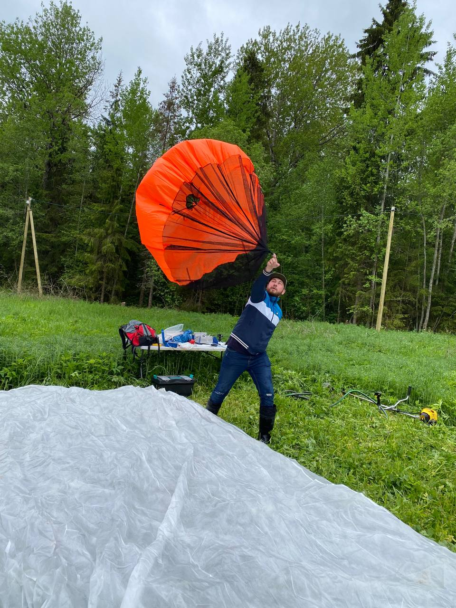

Дисплей... Дисплей - это провал. Мы почему хотели его? Потому, что сама камера не обладает GPS-приемником, соответственно финт ушами как на GoPro там не прокатит - синхронизировать видео по данным с камеры и наложить телеметрию в постобработке, как мы делали это ранее. Так что родился план, надежный как швейцарские часы: поместить в кадр дисплей, на который будет выводиться телеметрия в реальном времени. Благодаря обзору камеры, мы могли бы в любой момент обратить свой взор на него и узнать "где мы??". Но... солнце ¯\\_(ツ)/¯ Из-за бликов ничего не видно. Ладно, отработали запуски с доп. грузом. Не отчаиваемся.

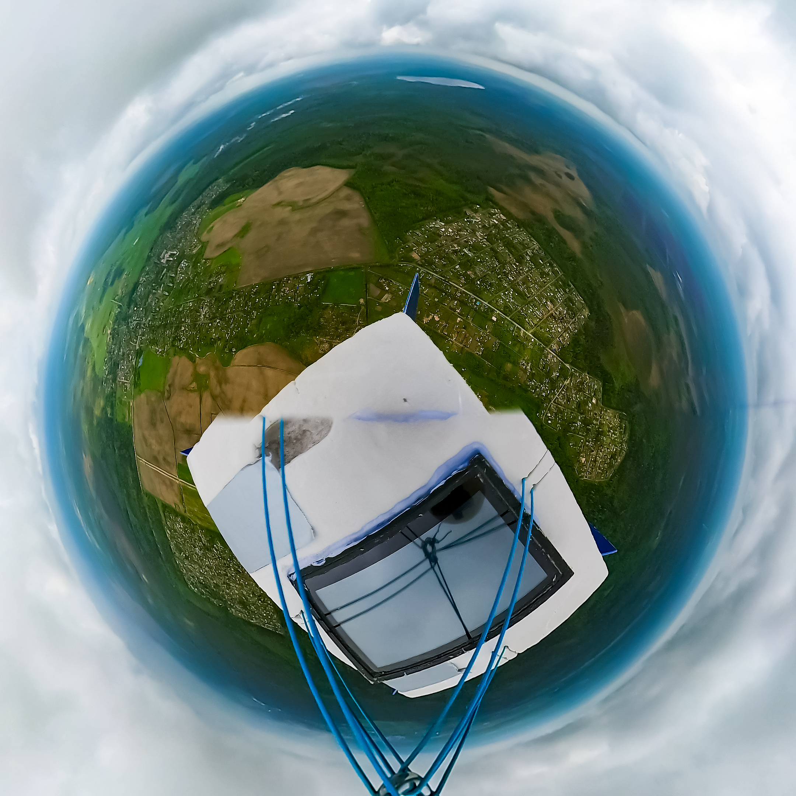

А вообще должно было выглядеть вот так:

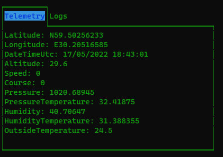

ВОДОРОД.

Не знаю, на кой ляд вам дался этот водород, но я в ваши дела не лезу. Раз надо водород - получите водород.

Из плюсов водорода перед гелием:

- он в 3 раза дешевле
- его надо в 2 раза меньше (мы закачали **половину** стандартного 40л баллона)

Из минусов:

- всем пришлось бросить курить
- его нельзя перевозить в салоне\багажнике авто - нашли газель

## Поиск и спасение

Ребят, тут все было очень скучно - зонд упал в 20 метрах от дороги ¯\\_(ツ)/¯ Просто подошли и забрали. Его, конечно, потрепало об ветки и при ударе он немного разлетелся в стороны, но все оборудование работает в данный момент штатно. Даже несмотря на то, что из короба мы слили примерно литр осадков и, похоже, местные медведи похитили у нас один павербанк (мы не смогли его обнаружить в радиусе 5 метров от места крушения). Ну ладно, пусть он служит им долго и верно.

Отмечу лишь, что прогноз маршрута, построенный на все том же [CUSF Landing Predictor](http://predict.habhub.org/), оказался очень точным. Зонд приземлился в 50 метрах от расчетного места.

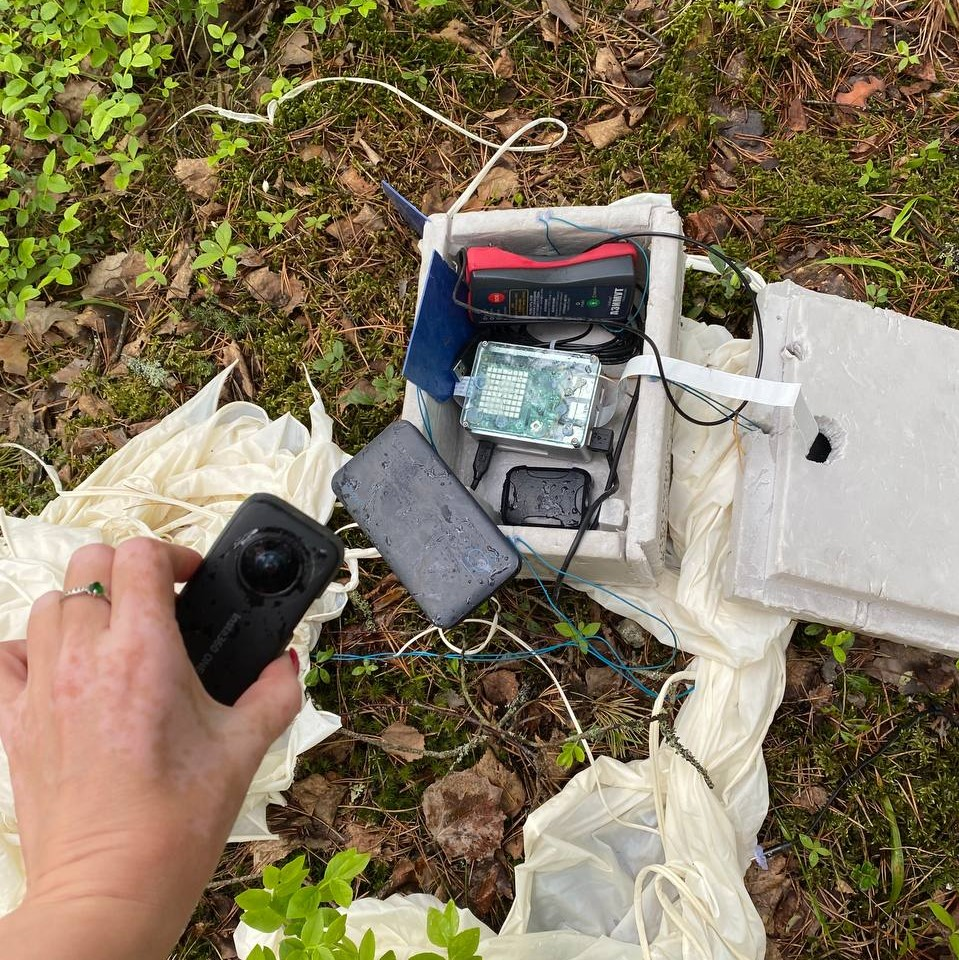

## Куда мы улетели?

### Высота

Нормально улетели, но это не точно)) Температуры\влажности\гироскопы и т.п. мы уже разбирали много раз. Там без изменений. Самое главное для нас в этом запуске - высота!

Иииии... У нас снова "устал" GPS в полете. Такое уже случалось ранее и в коментах народ предполагал, что это может быть из-за ориентирования антенны. У меня нет повода спорить с этим предположением. В этот раз антенна GPS просто болталась на проводе снизу. Что же, надо было что-то испортить, вот мы испортили GPS. Но у нас есть план "Б" (всегда)!

[Барометрическое нивелирование](https://ru.wikipedia.org/wiki/%D0%91%D0%B0%D1%80%D0%BE%D0%BC%D0%B5%D1%82%D1%80%D0%B8%D1%87%D0%B5%D1%81%D0%BA%D0%BE%D0%B5_%D0%BD%D0%B8%D0%B2%D0%B5%D0%BB%D0%B8%D1%80%D0%BE%D0%B2%D0%B0%D0%BD%D0%B8%D0%B5) и высшая математика. Первое работает плохо на высотах выше 12км, во втором я не разбираюсь. Но это не помешает мне утверждать, что с вероятностью 100% мы достигли минимальной для нас высоты - 30км.

Давайте сразу график:

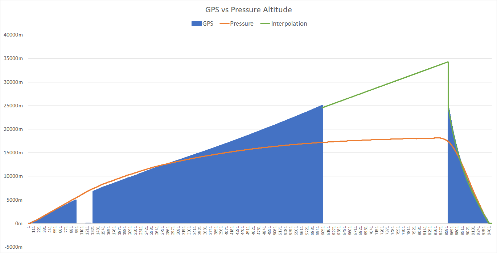

Итак, видно, что в полете мы теряли GPS несколько раз. А после 25км он пропал надолго и вернулся только на обратном пути. Хорошо, что мы пофиксили старый баг, из-за которого теряли все данные без сигнала GPS.

> Вы знаете, у нас есть "конспирологическая" теория, что GPS там пропадал неслучайно... Т.к. он так же пропадал и на обоих поисковых трекерах. С другой стороны - ОрВД разрешило нам запуск из этой точки, значит никаких "закрытых" зон мы пересекать не должны были. Ну, это всего лишь догадки.

Оранжевая линия - это барометрическое нивелирование. Видно, что оно очень хорошо совпадает с GPS до 12-13км, а выше идет в разнос.

Зеленая линия - это линейная интерполяция в Excel. Интерполировал только верхний сегмент полета. Как смог, так смог. Если кто-то умеет лучше - все данные в репозитории, ссылки в статье.

### Давление

Слабый аргумент, если взять во внимание особенности барометрического нивелирования, но все равно аргумент:

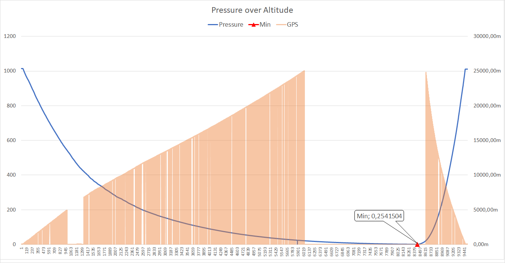

Минимальное значение в этот раз: **0.25mbar**

Я напомню\дополню табличку с прошлого запуска:

| Шар | Высота (м) | Давление (мбар) |
|-----|-------------------|-----------------|
| Vostok-1 | 18993 | 58 |
| Vostok-3b | 25573 | 19.8 |
| Vostok-4 | 35794 | 0.49 |
| **Vostok-5** | **?????** | **0.25** |

Что же, вдвое (!) ниже чем в прошлый раз! Да, здесь, конечно, не линейная зависимость. Мы и не говорим, что улетели на 70км. Но я считаю, что это достаточное доказательство того, что заданную высоту в 30км мы точно преодолели!

> Между собой мы голосуем за высоту ~34км

Убедительно? Убедительно. Теперь посмотрим своими глазами, что оттуда видно ;)

## Видео

Сначала гордость нашей миссии - 4k 30fps сферическое (с обзором 360 градусов) видео всего полета. Как я уже упоминал выше - можно крутить камерой в приложении YouTube или у них на сайте (не ручаюсь за встроенные видео), можно использовать VR функцию YouTube и смотреть в очках (даже картонных). Таким образом у вас появится возможность лично пережить крушение аппарата и влететь на всей скорости в елки. А еще, у некоторых наших бета-тестеров, на высоте возникала тошнота и легкое головокружение. Имейте в виду.

В видео есть разбивка на эпизоды, т.к. не каждый выдержит 2,5 часа смотреть в пустоту.

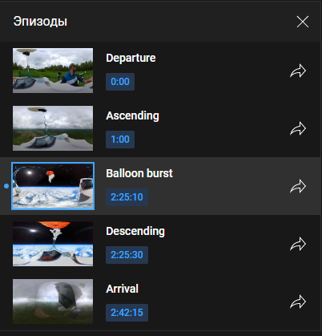

Думаю, сориентируетесь :)

Гифка для затравки со взрывом шара:

Фотка, чтобы бесить плоскоземельщиков:

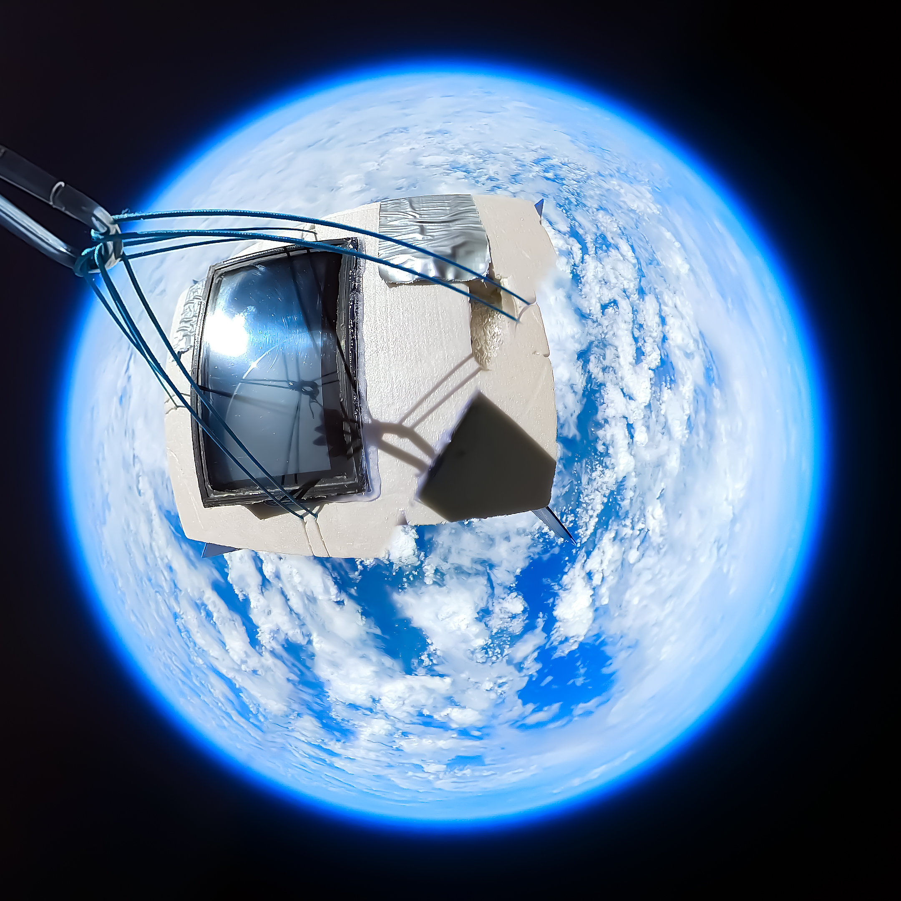

Еще хорошо видно, особенно на этапе "посадки", что парашют нам практически не пригодился... Да, он конечно немного замедлил падение, а основную роль, я думаю, он сыграл, цепляясь за ветки. Нооооо... Мы немного на другое рассчитывали :) Если коротко, наша версия такова:

- парашют раскрылся в верхней точке
- остатки шара упали ниже уровня парашюта
- набегающим потоком шар загнало под купол и это нарушило работоспособность парашюта

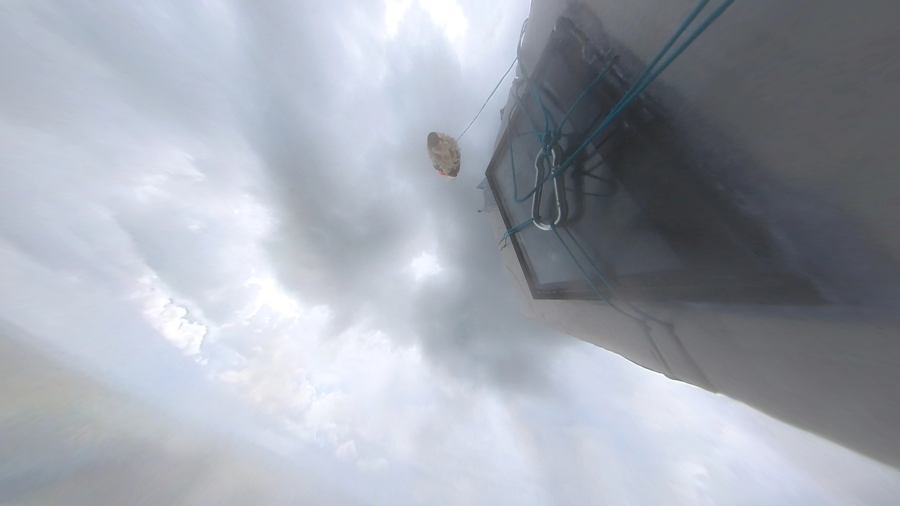

Доставка этого видео на ютуб потребовала от нас решения некоторых задач. Исходник материала размером ~105GB. Не все из них - полет. Часть - это процедуры перед запуском, часть - лежание на земле после крушения. Но около 90GB - это полет. С горем пополам, используя технологическое преимущество вашего расказчика и корпоративное оборудование - мы перемещали эти данные за тысячи километров, обрезали, склеивали и заливали на ютубы почти целую неделю.

Бонусом нарезали короткое reframe-видео под веселую royalty-free музычку из банка YouTube. Не обессудьте - я у мамы монтажер (около 4-х минут):

## Выводы

В итоге, все цели поставленные перед миссией, были выполнены. Видео 4k с высоты 30+ км. мы привезли. Его можно крутить, его можно смотреть, его можно использовать в дебатах со сторонниками теории плоской земли.

На данные момент мы поставили новую цель - снизить стоимость запусков. Для этого надо снизить стоимость "расходников". Наш самый дорогой, до сих пор - это шар. Латекс из Китая массой 2 кг. занимает примерно 80% всех расходов в каждом запуске. Нам подсказывали ранее, что хорошей альтернативой может стать полиэтилен. Это мы и вознамерились проверить. Если с ним всё сложится, то это уменьшит стоимость запуска на 2 порядка!. Между собой мы называем это - запуск на пакетах из Ашана.

Что делать с парашютом - мы пока не знаем. Возможно проблема уйдет сама при запуске на пакетах. Ну и с бликами дисплея надо что-то придумать. Пока что рабочая версия - разместить "как-то" на боковой стенке. Будем посмотреть.

- Полная версия на [Хабре](link)
- Файлы [телеметрии](https://github.com/ArtemKiyashko/ProbeLoggerArticle5/tree/master/telemetry)

На этом всё. Fly safe, cmdr!

