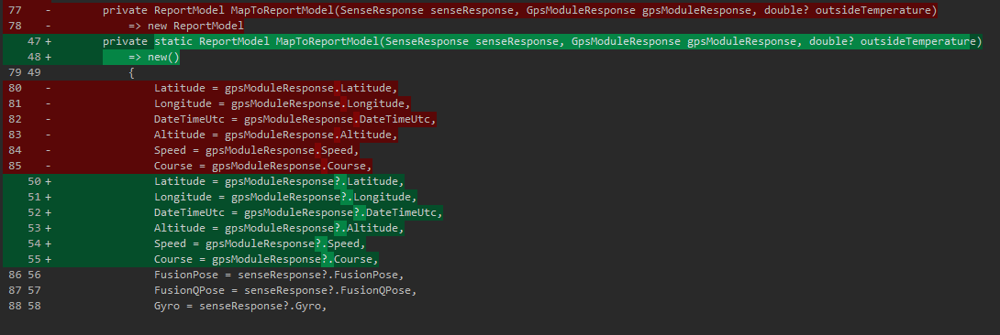
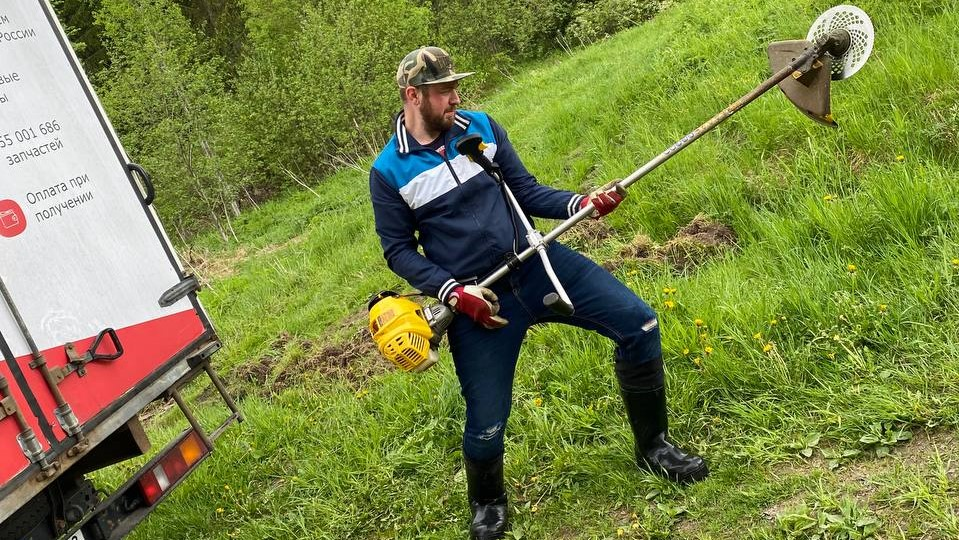

# Самодельный стратостат. Сезон 2022. Часть 1

## Вступление

Так как я считаю, что "просветительскую" часть миссии мы закрыли в прошлом сезоне, опубликовав, фактически, пошаговую инструкцию по созданию таких зондов из ничего, то теперь я буду опускать большинство деталей. Это позволит не раздувать и без того не маленький текст, и сосредоточиться на более веселом - на видосах :) Тем более что теперь там точно есть на что посмотреть. Чуть подробней чем "никак" я опишу лишь критически важные для миссии места.

Если появятся вопросы, даже если ответы на них есть в других статьях (смотрите у меня [в профиле](https://habr.com/ru/users/v0stok86/)) - задавайте в коментариях. Я отвечаю на все и всё что знаю. Начнем.

## Список оборудования и компонентов

Буду краток:

- Новый поисковый трекер [Азимут IRIDIUM/GSM](https://www.decima.ru/video_audio/catalog/navigatsionnye_pribory/treker_navigatsionnyy_sputnikovyy_azimut_iridium_gsm/)
- Новая камера [Insta360 One X2](https://www.insta360.com/ru/product/insta360-onex2)
- LCD дисплей для отображение телеметрии [Waveshare 4.1inch Touch DSI](https://www.waveshare.com/4.3inch-dsi-lcd.htm)

Всё остальное - без изменений. Тот же RPI 4b, SPOT Trace (почему снова он - объясню ниже) и павербанки что и в прошлый раз. Теперь о каждом пункте немного подробней.

## Конструкция

### Полезная нагрузка

#### Трекер

Как вы могли заметить по списку оборудования, у нас кое-что добавилось в полезной нагрузке. А именно новый, автономный **поисковый** трекер! Это очень важный момент, на котором хотелось бы заострить внимание, так как это может быть полезно для ваших запусков (в своей первой статье про [Самодельный стратостат](https://habr.com/ru/post/555070/) я объяснил важность этого компонента).

Итак, наш любимый SPOT Trace, служивший нам верой и правдой весь прошлый сезон, начал немного хворать. Нет, он проджолжал присылать координаты, но делать это стал как-то неуверенно и не долго. Батареи садились примерно за неделю (да, мы их меняли и не раз - не помогло). Это все еще очень хороший показатель автономности и новый трекер его не перебивает. Но... захотелось подстраховаться. Таким образом мы выторговали на просторах интернета б\у трекер отечественного бренда - "[Азимут IRIDIUM/GSM](https://www.decima.ru/video_audio/catalog/navigatsionnye_pribory/treker_navigatsionnyy_sputnikovyy_azimut_iridium_gsm/)".

> Мы купили у официального поставщика именно б\у трекер, списаный и снятый с какого-то самолета. Он нам обошелся в 32400 рублей.

Он имеет на борту 2 канала связи для передачи координат: спутниковую сеть IRIDIUM и мобильную сеть GSM. GSM используется когда доступна, в противном случае переходит на спутник. Такое поведение нам очень нравится.

Проблема этого трекера в малой автономности. Заряда встроенного аккумулятора, согласно официальной инструкции, хватает на "десятки часов". Вроде достаточно, но сильно меньше чем у SPOT. С другой стороны, этот недостаток покрывается лучшим охватом и более уверенной связью IRIDIUM. Напомню, что автономность SPOT нас спасала в условиях плохого сигнала (использует спутниуовую инфраструктуру Globalstar), когда трекер молчал **несколько дней** и только потом прорезался сигнал. Чтож, если с сетью все ок, то "десятков часов" нам хватает с запасом.

Тем не менее, в этот запуск мы решили не рисковать *настолько* и **положили в коробку оба трекера** ¯\\_(ツ)/¯

Фото этого чуда и его комплектация:


Следить за его положением вы можете на сайте [flyrf.ru](https://flyrf.ru/). Вверху надо включить отображение АОН/БАС и в поиске ввести наш ID: **VSTK0160**

Должны увидеть что-то вроде:


В истории видно, каким каналом был отправлен трек (поле: Тип пакета):


Ну а дальше разберетесь по кнопкам.

> Небольшое отступление про возможности конфигурации этого устройства. Механика схожа со SPOT Trace: есть десктопная программа, ставите, конфигурируете. Это приложение предоставляет поставщик трекера, через него же (поставщика) идет оплата подписки. Напрямую Iridium (именно их сеть используется как канал передачи данных) платить нельзя - только через посредников (и это не нововведение - это всегда так было, насколько я знаю). На [странице поставщика](https://www.decima.ru/video_audio/catalog/navigatsionnye_pribory/treker_navigatsionnyy_sputnikovyy_azimut_iridium_gsm/) есть тарифная сетка. В опции конфигурации углубляться не буду, иначе этот текст никогда не закончится. Скажу лишь, что мы поставили интервал треков в 300 сек в состоянии движения и 3600 сек в покое. С целью экономии батареи.

Таким образом, у нас на борту появилось уже 3 приемника и 2 передатчика координат. Интерференция может насоздавать проблем в таком случае. В документации SPOT есть рекомендация: располагать трекер не ближе 30см от других приемо-передатчиков. Легко сказать, но как это сделать в малюсенькой коробке зонда?

Никак.

Можно конечно поиграться с проводами/выносными мачтами, привязать трекер к стропам/фалу и т.д., но не забываем про температуру и как к ней относятся элементы питания! Есть риск, что снаружи аккумуляторы замерзнут еще на подъеме. Да, они потом отмерзнут и возможно включатся снова. *Возможно*. Ситуация спорная, так что мы решили тупо протестить - включали трекеры рядом друг с другом, носили их по городу в одной сумке и т.п. Результаты нам понравились - оба трекера работали как обычно. Так что было принято решение все же разместить их внутри короба и обеспечить штатным обогревом.

Вот, как они расположились внутри короба:


#### Камера

Второе важное изменение - мы поменяли камеру. Прошлая GoPro 7 Black нас устраивала всем, кроме угла обзора. Очень хотелось посмотреть еще и на шар в полете. Мы даже разрабатывали вариант с 2-я камерами - одна на шар, вторая на горизонт. Но 2 камеры это двойной вес и двойное питание (что опять же - новая масса). Так что мы решили проблему координально - приобрели камеру с обзором 360 градусов! А конкретно [Insta360 One X2](https://www.insta360.com/ru/product/insta360-onex2). Да-да, теперь наши видосы можно смотреть в VR очках. Даже в таких [картонных](https://imcardboard.com/), я лично в таких и смотрю :) Эффект погружения - присутствует.

Теперь эту камеру надо как-то разместить на коробе. Так, чтобы не потерять в полете, чтобы она не перегрелась и чтобы ничто не мешало обзору.

Родился такой план:


Основание немного утоплено в пенопласт (из-за этого пришлось наложить второй слой крышки - чтобы не нарушать термоизоляцию внутренностей) и зафиксировано термоклеем. Основное пятно нагрева у этой камеры в зоне объективов, так что перегреться не должна. Прямой вид на горизонт, а так же на следующее дополнение нашей конструкции.

#### Дисплей

Здесь я, в основном, затрону "железную" часть вопроса и зачем нам вообще понадобился дисплей.

Итак, если вы помните, в прошлом сезоне у нас было 2 источника телеметрии: RPI с GPS HAT + набор сенсоров и GoPro 7. Данные с GoPro позволяли нам легко синхронизировать видео с показаниями RPI (чтобы сделать наложение телеметрии на видео). Это было нам необходимо, так как камера не обладает всеми необходимыми нам датчиками (температур, давления и т.п.). В новой камере такой роскоши нет. Чтобы иметь в метаданных видео показания GPS - нужно использовать специальный отдельный модуль для этой камеры (ну и купить его, соответственно). Питание для этого модуля тоже нужно отдельное. Мда, тут наславу потрудился маркетолог. Нуштош...

Можно было пойти и по пути покупки этого модуля, но мы решили сделать чуть более надежно (и более распространенно в среде запускателей подобных зондов) - добавить в кадр показания самого RPI. Это все так же дополнительная масса и увеличенное энергопотребление, но добавлять новых батарей нам не потребовалось - питания подсистемы телеметрии хватало с запасом и на дисплей.

Плюсом мы исключали полностью необходимость синхронизации телеметрии и видео. А обзор камеры позволял внедрить следующий сценарий использования: в нужный момент останавливаем видео при просмотре и поворачиваем обзор на дисплей. С прошлой камерой такого бы "не прокатило".

Вот [этот дисплей](https://www.waveshare.com/4.3inch-dsi-lcd.htm) мы выбрали. Не очень большой, не очень маленький, с хорошей яркостью (как я тогда думал, но об этом в результатах), подключается к порту DSI, не требует внешнего питания и есть тач. Зачем тач и почему он не пригодился, я раскажу в разделе про программирование.

> Забавный момент: в комплекте идет шлейф длиной 5см для подключения к RPI. При нашей компоновке этого маловато и мы решили купить что-то длиннее. Забавно тут то, что во всей стране именно эти 15pin FFC шлейфы занесены в красную книгу. Мы с большим трудом нашли последние 10 штук на складе одного магазина и забрали сразу все (цена за штуку там была что-то около 32р). Альтернатива - заказ из Китая. Там они есть, но долго ждать. В итоге у нас появилось десять 15-сантиметровых шлейфов. Должно хватить.

Корпус для него распечатали на 3D-принтере. Я до сих пор не уверен - было ли это хорошее решение, но наш конструктор настоял (основание - возможно долгое пребывание в неблагоприятной среде), а я не возразил. Как по мне, так можно было просто залить там все герметиком, ну да ладно.

Больше изменений "внутри" нет. Посмотрим, что поменялось снаружи.

### Общая конструкция

Основное отличие - мы заменили гелий на водород. Да, нас несколько раз убеждали, что это - ключ к успеху, хоть и не очень ясно к какому. Но кто мы такие, чтобы отказываться? Когда мне говорят что-то в интернете - я верю!

Из плюсов водорода перед гелием:

- он в 3 раза дешевле
- его надо в 2 раза меньше (мы закачали **половину** стандартного 40л баллона)

Из минусов:

- всем пришлось бросить курить
- его нельзя перевозить в салоне\багажнике авто - нашли газель

В остальном, принципиально ничего не изменилось аж с самого первого запуска. Так что за подробностями прошу в первую статью. Скажу лишь, что в этот раз мы снова использовали латексный шар L-2000 (масса 2000г). Заменили парашют на "побольше" и новый. А в остальном - все так же.


## Программирование

(пофиксили баг с отчетом и пустыми строками, добавили новый с дублирующимися хедерами, мигрировали на .net6, добавили пару юнит-тестов. все это весело через TeamViewer и SSH)

Без лишних деталей - [тот же репозиторий](https://github.com/ArtemKiyashko/RpiProbeLogger), тот же проект.

Пофиксили баг, обнаруженный в прошлый раз. Проявлялся он в том, что при потере сигнала GPS - мы теряли и все остальные данные. Звучит странно, но изначально логика была такова: время из GPS - наша точка синхронизации всех остальных данных. Без времени - мы не сможем понять за какой этап работы те или иные данные. Это было **ошибочное утверждение**. На самом деле время нам нужно лишь единожды - когда мы создаем файл лога (в качесте имени используется дата из GPS). Дальше данные собираются и пишутся раз в секунду по таймеру. Таймер - и есть наш источник синхронизации!

Ну а технически там просто была `NullReferenceException` при пустых данных GPS, которую я игнорировал, потому что потому (выше описал). Пофиксилось это всё простым `Nullable Check`:



Бонусом мы мигрировали все проекты на .NET 6 и дописали немного unit-тестов. И, видимо, мало дописали, т.к. при анализе телеметрии с этого запуска, мы обнаружили новый баг ¯\\_(ツ)/¯

Теперь у нас при "перезапуске" GPS (а в этот раз это случалось часто) дублировался заголовок CSV. Чтож... Это не потеря данных, а лишь небольшой мусор, который легко убирается при анализе. Это мы обязательно пофиксим к следующему запуску.

Теперь о более масштабном. LCD дисплей помните? Он нам нужен был, чтобы избежать необходимости наложения телеметрии на видео в постобработке. Ок, давайте выводить на него телемтрию тогда.

В интеренете мне сказали, что сейчас модно микросервисы. Вот вам микросервисы на минималках для RPI: проект по сбору телеметрии практически не подвергся изменениям, добавился новый проект `RpiProbeLogger.TerminalGui`, который суть есть - вывод данных в терминал.

Чтобы все это работало - надо эти две сущности как-то соединить. Отложите свои кафки обратно в стол - они нам не пригодятся. Для коммуникации была выбрана [ZeroMQ](https://zeromq.org/languages/csharp/). Основное отличие - отсутствие `Message Broker-а`. В данном случае, гарантированная доставка сообщений играет против нас. Дело в том, что дисплей должен отображать данные в реальном времени. Зачем нам очередь сообщений (из брокера), если эти "исторические" сообщения не будут отображать текущее состояние дел? Брокер хорошо, когда эти данные надо куда-то сохранить. А ZeroMQ отлично подходит для парадигмы **выстрелил и забыл**. К тому же, отсутсвие брокера (что само по себе уже минус сущность) - делает этот метод гораздо более "легковесным".

Итак, ZeroMQ использует TCP порты для приемо-передачи (так что возможна коммуникация как внутри одного процесса, так и межпроцессная). У меня родился low-level интерфейс:

```csharp
public interface IBusReporter
{
    public Task<bool> Send<T>(T model);
    public void BindPort(uint port);
}
```

`BindPort` занимает нужный нам порт, а `Send<T>` отправляет "что-то" в канал.

Вот полная реализация:

```csharp
public class BusReporter : IBusReporter, IDisposable
{
    private readonly PublisherSocket _publisherSocket;
    public BusReporter(PublisherSocket publisherSocket) => _publisherSocket = publisherSocket;

    public void BindPort(uint port) => _publisherSocket.Bind($"tcp://*:{port}");

    public void Dispose() => _publisherSocket.Dispose();

    public async Task<bool> Send<T>(T model)
    {
        var jsonModel = JsonSerializer.Serialize(model);
        var sendTask = Task.Run(() => SendMessage(jsonModel));
        return await sendTask;
    }

    private bool SendMessage(string jsonModel) => 
        _publisherSocket
            .TrySendFrame(TimeSpan.FromSeconds(1), jsonModel);
}
```

Да, библиотека `NetMQ` не содержит асинхронной версии `Send...`, так что обертки вам придется накрутить самим. Хотя это не единственный способ отправить что-то в канал и в документации, вы можете подыскать что-то более подходящее для ваших нужд. Нас устраивает и синхронный `TrySendFrame`.

Далее нам надо прикрутить эту отправку к текущей подсистеме сохранения данных в файл. И желательно не трогая эту саму подсистему. Первое, что пришло в голову, это нелюбимый мной паттер "Декоратор". Декорировать, понятное дело, будем интерфейс `IReportService`. Появилась еще одна его реализация `TelemetryReporter`. Полный листинг приводить тут не буду (если надо смотрите репозиторий), тут лишь интересущий нас больше всего метод:

```csharp
public async Task<ReportModel> WriteReport(SenseResponse senseResponse, GpsModuleResponse gpsModuleResponse, OutsideTemperatureResponse outsideTemperatureResponse)
{
    var result = await _decoratee.WriteReport(senseResponse, gpsModuleResponse, outsideTemperatureResponse);

    if (!_busPortReady) return result;
    await SendTelemetry(result);
    return result;
}
```

По классике: сначала вызываем декорируемую реализацию, потом пробуем отправить результат в ZeroMQ через `IBusReporter`.

Ну и теперь надо встроить этот декоратор в механизм разрешения зависимостей (заинжектить в DI):

```csharp
private static void AddReportingServices(IServiceCollection services)
{
    services.TryAddTransient<PublisherSocket>();
    services.TryAddTransient<IBusReporter, BusReporter>();
    services.AddTransient<ILedMatrix, LedMatrix>();
    services.AddTransient<IReportService, ReportService>()
        .Decorate<IReportService, TelemetryReporter>();
    services.AddSingleton<IStatusReportService, StatusReportService>();
    services.AddTransient<IReportFileHandler, ReportCsvHandler>();
}
```

Единственное, что здесь изменилось - добавился вызов метода `Decorate`. Все! Теперь при запросе `IReportService` из DI - этот DI будет оборачивать реализацию в наш декоратор. Больше никаких изменений в этом проекте можно не делать.

> .NET в любой версии не содержит метода расширения `Decorate` (и очень похоже, что никогда и не будет содержать). Этот метод из известной библиотеки `Scrutor`

*Можно* не делать, но я еще немного сделал для понижения у себя уровня стресса - добавил кастомный `ILogger` утилизирующий ZeroMQ, но на отличном от `TelemetryReporter` порту. Я подумал: ну а чо, пусть еще и ошибки на дисплей выводит? Реализация `ILogger` позволила мне добавить эту фунциональность не трогая бизнес-логику (логгер то там так и так используется).

```csharp
public class BusLogger : ILogger
{
    private readonly IBusReporter _busReporter;

    public BusLogger(IBusReporter busReporter) => _busReporter = busReporter;

    public IDisposable BeginScope<TState>(TState state) => default;

    public bool IsEnabled(LogLevel logLevel) => true;

    public void Log<TState>(LogLevel logLevel, EventId eventId, TState state, Exception exception, Func<TState, Exception, string> formatter)
    {
        if (!IsEnabled(logLevel)) return;
        try
        {
            _busReporter.Send(
                new LogEntry(
                    logLevel,
                    formatter(state, exception),
                    exception?.Message,
                    exception?.StackTrace))
                .GetAwaiter().GetResult();
        }
        catch { }
    }
}
```

Полная реализайция экосистемы логгеров в дотнете требует еще пары верхнеуровневых имплементаций, но тут я их приводить не буду. Если будете гуглить, то в любом случае на них нарветесь. Ну или посмотрите в моем репозитории.

> ZeroMQ поддерживает "топики", но имя топика это фактически часть сообщения на том же порту, просто в отдельном кадре. Это может создавать состояние гонки (race condition) при чтении. Так что я решил просто разделить по портам телеметрию и логи, и не использовать топики совсем.

Хорошо, отправлять мы отправляем. Теперь давайте получим. Это еще проще (прыгаем в проект `RpiProbeLogger.TerminalGui`):

```csharp
public abstract class BaseReceiver<T> where T : struct
{
    protected readonly IDirector<T> _director;
    protected readonly SubscriberSocket _subscriber = new();

    protected BaseReceiver(IDirector<T> director)
    {
        _director = director;
    }

    protected virtual void ReceiverLoop()
    {
        while (true)
        {
            var msg = _subscriber.ReceiveFrameString();
            T model = JsonSerializer.Deserialize<T>(msg);
            _director.Refresh(model);
        }
    }
}
```

Базовый класс "получателя". Просто в бесконечном цикле ждем сообщения из канала. Т.к. канала у нас 2 (логи и телеметрия), то и наследника у этого класса 2: `TelemetryReceiverHostedService` и `LogsReceiverHostedService`. Как можно догадаться, эти классы так же реализуют `IHostedService` и работают параллельно в экосистеме `IHost`. Вот весь `Program.cs` этого проекта:

```csharp
class Program
{
    private static IHost _host;
    private static IConfiguration Configuration;

    static void Main(string[] args)
    {
        _host = new HostBuilder()
            .ConfigureAppConfiguration((context, builder) => {
                builder.AddJsonFile("settings.json", true);
                builder.AddEnvironmentVariables();
                Configuration = builder.Build();
            })
            .ConfigureServices((hostContext, services) =>
            {
                services.AddHostedService<TelemetryReceiverHostedService>();
                services.AddHostedService<LogsReceiverHostedService>();
                services.AddSingleton<IDirector<Telemetry>, TelemetryDirector>();
                services.AddSingleton<IDirector<LogEntry>, LogDirector>();
                services.AddSingleton<View>(provider => provider.GetService<TelemetryView>());
                services.AddSingleton<TelemetryView>();
                services.AddSingleton<View>(provider => provider.GetService<LogView>());
                services.AddSingleton<LogView>();
                services.Configure<TelemetryReceiverSettings>(Configuration.GetSection("TelemetryReceiverSettings"));
                services.Configure<LogsReceiverSettings>(Configuration.GetSection("LogsReceiverSettings"));
                services.AddSingleton<MainWindow>();
            })
            .Build();

        var telemetryDirector = _host.Services.GetRequiredService<IDirector<Telemetry>>();
        var logDirector = _host.Services.GetRequiredService<IDirector<LogEntry>>();

        telemetryDirector.OnRefresh += UiRefresh;
        logDirector.OnRefresh += UiRefresh;

        Application.Init();
        Application.Run(_host.Services.GetRequiredService<MainWindow>());
    }

    private static void UiRefresh(object? sender, EventArgs e) => Application.DoEvents();
}
```

Хорошо, данные мы получили. Давайте теперь их красиво выводить в терминал. Вы уже могли заметить выше какие-то `MainWindow`, `View`, etc. Это результат использования библиотеки [Gui.cs](https://github.com/migueldeicaza/gui.cs). Она хорошо справляется с рисованием вьюшек в консоли, а так же умеет обрабатывать пользовательский ввод (мышка, клавиатура).

> Единственная неприятность, которая у меня возникла - именно на RPI эта библиотека не обрабатывает события мыши. Я даже завел авторам Issue на гитхабе, где, после недолгих рабирательств, пометили это как баг. А я просто забил на мышку, т.к. не очень то она и нужна на зонде.

Библиотека содержит демо-проект и очень хорошо документирована, так что я не буду тут приводить свои куски кода. Просто покажу, что получилось:


Если кратко: есть корневой уровень - Application.Top. Это должен быть наследник `TopLevel` (мой MainWindow), которому в зависимостях передается коллекция `View` (Telemetry и Logs). MainWindow создает `TabView` и добавляет табы из этой коллекции. Ладно, 1 кусок приведу (а то объясняю как петикантроп):

```csharp
public MainWindow(IHost host, IEnumerable<View> views) : base()
{
    _host = host;

    Loaded += MainWindow_Loaded;
    Closing += MainWindow_Closing;

    foreach (var view in views)
        _tabView.AddTab(new TabView.Tab(view.Id?.ToString(), view), false);

    _tabView.SelectedTab = _tabView.Tabs.First();
    Add(_tabView);
}
```

Следую заповедям IoC, каждая `View` сама отвечает за свое содержимое: рисует нужные элементы, получает данные, обновляет (из того же `BaseReceiver`) их и т.д.

Пожалуй остановимся на этом. Если есть вопросы - давайте в комменты или в репу (。_。)

## CI/CD

Azure Devops. Проблемы с агентом при добавлении Environment (ссылка не на arm агента). Надо найти в настройках -> пулы -> агенты ссылку на arm агента

## Бухгалтерия

(лол кек купили вездеход... новая камера, шар 2000г)

## Подготовка к запуску

Да, тут мы поели "варенья"... Я не буду тут описывать те же вещи, что в каждой прошлой статье (про построение прогноза маршрута, выбора точки запуска и т.д.), опишу подробно лишь одну, так как она имеет критическое значение.

### Полетный план

Тот красивый и удобный сайт (new.ivprf.ru), который я рекламировал в прошлом сезоне - закрылся, так до конца и не открывшись. Это очень печальная новость, потому что теперь придется составлять планы "руками" и отправлять их по электронной почте (спасибо, что не факс, хотя на заре наших запусков была и такая история). Но, как оказалось - не все так страшно. Мы это делаем не первый раз и уже имеем шаблон для планов шаров-зондов:

```bash
(SHR-ZZZZZ
-ZZZZ1200
-K0300M3000
-DEP/5850N03325E DOF/220604 OPR/ИВАНОВ ИВАН ИВАНОВИЧ +79001234567 mymail@mail.ru
TYP/SHAR RMK/ОБОЛОЧКА 300 ДЛЯ ЗОНДИРОВАНИЯ АТМОСФЕРЫ SID/VSTK0160)
```

Это **абсолютно полный** полетный план шара-зонда. Именно в таком виде он отправляется в теле письма на почту зональному центру ОрВД.

> Как понять какой у вас зональный центр и куда писать смотрите в [Самодельный стратостат. Полётный план и ОрВД](https://habr.com/ru/post/592383/) или на [сайте ОВД](https://gkovd.ru/services/class-g/). В нашем случае это был СПБ ЗЦ с адресом spbzc@sz.gkovd.ru

Давайте разберем его по косточкам, чтобы вы могли легко адаптировать его под себя.

1. `(SHR-ZZZZZ` Открывающая круглая скобка - начало сообщения. Обязательно. `SHR` - тип сообщения (иногда используется кириллица - СХР). Для шаров-зондов это всегда SHR. `-ZZZZZ` далее через дефис идет рег. номер воздушного судна, если имеется. Если не имеется - 5 букв Z. Самодельному стратостату регистрацию не делают (во всяком случае маложивущему, может для тех кто летает через 12 часовых поясов и делают, но у нас не тот случай)
2. `-ZZZZ1200` Дефис и 4 буквы Z - заглушка для кода аэродрома вылета. Если запускаетесь с аэродрома - тут должен быть код. Мы запускаем по географическим координатам - значит у нас заглушка. `1200` далее без пробелов\дефисов - время вылета по UTC(!)
3. `-K0300M3000` Первая часть K0300 - скороподъемность аппарата в метрах в минуту (впереди лидирующий 0 для фиксации длины сообщения, обязателен). У нас 300 метров в минуту. Вторая часть M3000 - максимальный эшелон полета. Эшелон 3000 соответствует 30000 метров (или 30км). Просто делите свою максимальную ожидаемую высоту на 10 и получите свой эшелон.
4. `-DEP/5850N03325E DOF/220604 OPR/ИВАНОВ ИВАН ИВАНОВИЧ +79001234567 mymail@mail.ru
TYP/SHAR RMK/ОБОЛОЧКА 300 ДЛЯ ЗОНДИРОВАНИЯ АТМОСФЕРЫ SID/VSTK0160)` Да, все в одну строчку, через пробел.
    - `-DEP/5850N03325E` Координаты места запуска. Их формат смотрите в предыдущей статье, ссылка выше.
    - `DOF/220604` дата запуска в формате `YYMMDD`.
    - `OPR/ИВАНОВ ИВАН ИВАНОВИЧ +79001234567 mymail@mail.ru` ФИО и контактные данные (реальные) того кто запускает стратостат. С ним и по этим контактам будет связываться ОрВД и диспетчер запуска.
    - `TYP/SHAR` Тип воздушного судно. Для нас это SHAR.
    - `RMK/ОБОЛОЧКА 300 ДЛЯ ЗОНДИРОВАНИЯ АТМОСФЕРЫ` Примечание в свободной форме. ОрВД просило указывать это - мы указываем.
    - `SID/VSTK0160` Идентификатор сообщения в системе ОрВД. Можно не указывать, они сами присвоят. Мы, зачем-то указали. Но это не обязательно.
    - `)` Зкрывающая скобка - конец сообщения.

Надеюсь все ясно. Да и бОльшую часть информации мы разбирали в прошлой статье. Информация-то на самом деле та же, просто там формы на сайте позволяли вводить ее в более привычном виде. Теперь такой роскоши нет.

**Второй момент**, который может омрачить ваше общение с ЗЦ. Я не хочу обвинять кого-то конкретного, да это и ни к чему, но... Пару раз нам перезванивали и мы слашали в трубке нечко вроде: Ало, это Иван Иваныч? А какого лешего мы должны сопровождать ваши запуски? Вы, вообще, с какого заведения?

При этом на почту они присылают такое:


Чтож... организация большая, государственная. Не лишена структурных "особенностей". Люди работают разные, некоторые - сменами. Так что, даже если вы день назад обо всем договорились, то на следующий день вам может позвонить другой человек и озвучить тот же монолог. Такое случалось.

Ирония заключается в том, что прочитав этот пункт 54 ФП ИВП постановления 138 от 11 марта 2010г (самое свежее на данный момент) по [ссылке на их же сайте](https://gkovd.ru/upload/activities-files/postanovlenie138.pdf), можно найти там такое:


Продублирую текстом: *Разовые запуски шаров-зондов производятся на основании планов использования
воздушного пространства и разрешений на использование воздушного пространства.*

Планы предоставляете вы в ЗЦ ОрВД, а разрешения выдают они вам. Никакого согласования с федеральным агенством воздушного транспорта! Именно такой ответ их удовлетворил и они приняли наши планы, и разрешили запуски. Да, человек на том конце провода взял перерыв на "посоветоваться с начальством", но совет от начальства оказался на нашей стороне. На следующий день история повторилась (возможно пришла новая смена) и мы ее "разрулили" точно так же - упоминанием этого абзаца.

## Запуск

Приперевшись на первую точку запуска, мы поняли, что это именно "первая" точка запуска аппарата Vostok-5. Мы тупо забыли про ветер. Да... Казалось, мы предусмотрели сотни вариантов провала, но абсолютно все забыли, что бывает ветер. Проблема в том, что она (точка) находилась посреди поля. Вокруг ни деревца. Ветер, порывами, был до 15 м\с. Он просто не давал накачать шар, вырывая его из рук и угрожая повредить его. Это заставило нас перенести запуск еще на 2 недели.

Приемлемым ветром мы посчитали скорость до 5 м\с и стали отталкиваться от этой цифры при выборе следующей даты запуска.

К назначенной дате мы выработали следующий протокол:

- за неделю до предполагаемой даты ищем 3 точки
- за 3 дня сверяем погоду, если, хотя бы в одной точке, погодные условия нас устраивают - подаем полетные планы (мы в итоге подали планы во все 3 точки)
- за день до запуска перепроверка погоды, отменяем планы в ОрВД в точках, которые стали непригодны
- повторяем последний пункт в день запуска

Во второй раз нам повезло больше, плюс мы специально акцентировали свое внимание на точках, которые находятся под прикрытием леса - это сильно снижает скорость ветра. Скорость ветра важна, в основном, до того как вы отпустите шар. Что там будет на высоте - уже мелочи.

Повезло нам вдвойне, так как на этот раз нам согласовали точку запуска всего в часе езды. Это давало нам широкий простор для маневров. Можно было не ночевать в мотелях ожидая приземления, а просто поехать поспать домой. Можно было, в случае чего, сместиться дальше по маршруту и запуститься из запасной точки и т.п. Места, конечно, там как обычно, так что пришлось немного покосить траву. В остальном запуск прошел без приключений.



Я, кстати, на нем [тоже присутствовал](https://youtube.com/shorts/PP707cHpvwg?feature=share), хоть и не планировал.

> Ну и да - не стоит забывать про осадки. Я думаю это очевидно, что накачивать шар под дождем мало того, что не комфортно, так еще и вредно для шара (электроника +\\- в любом случае у вас должна быть защищена от воды, т.к. неизвестно сколько она потом будет валяться на земле до вашего прибытия). Но опять же - это важно только до непосредственного запуска. Далее шар достаточно быстро пробьет облачность и осадков там не будет.

## Поиск и спасение

Ребят, тут все было очень скучно - зонд упал в 20 метрах от дороги ¯\\_(ツ)/¯ Просто подошли и забрали. Его конечно потрепало об ветки и при ударе он немного разлетелся в стороны, но все оборудование работает в данный момент штатно. Даже не смотря на то, что из короба мы слили примерно литр осадков и, похоже, местные медведи похитили у нас один павербанк (мы не смогли его обнаружить в радиусе 5 метров от места крушения). Ну ладно, пусть он служит им долго и верно.

Отмечу лишь, что прогноз маршрута, построенный на все том же [CUSF Landing Predictor](http://predict.habhub.org/), оказался очень точным. Зонд приземлился в 50 метрах от расчетного места.

## Результаты

### Высота

Ура, ура! Это меня радует, но тоже коротко. Температуры\влажности\гироскопы и т.п. мы уже разбирали много раз. Там без изменений. Самое главное для нас в этом запуске - высота!

Иииии... У нас снова "устал" GPS в полете. Такое уже случалось ранее и в коментах народ предполагал, что это может быть из-за ориентирования антенны. У меня нет повода спорить с этим доводом. В этот раз антенна GPS просто болталась на проводе снизу. Что же, надо было что-то испортить, вот мы испортили GPS. Но у нас есть план "Б" (всегда)!

[Барометрическое невелирование](https://ru.wikipedia.org/wiki/%D0%91%D0%B0%D1%80%D0%BE%D0%BC%D0%B5%D1%82%D1%80%D0%B8%D1%87%D0%B5%D1%81%D0%BA%D0%BE%D0%B5_%D0%BD%D0%B8%D0%B2%D0%B5%D0%BB%D0%B8%D1%80%D0%BE%D0%B2%D0%B0%D0%BD%D0%B8%D0%B5) и высшая математика. Первое работает плохо на высотах выше 12км, во втором я не разбираюсь. Но это не помешает мне утверждать, что с вероятностью 100% мы достигли минимальной для нас высоты - 30км.

Давайте сразу график:


Итак, видно что в полете мы теряли GPS несколько раз. А после 25км он пропал надолго и вернулся только на обратном пути. Хорошо, что мы пофиксили старый баг, из-за которого теряли все данные без сигнала GPS.

> Вы знаете, у нас есть "конспирологическая" теория, что GPS там пропадал не случайно... Т.к. он так же пропадал и на обоих поисковых трекерах. С другой стороны - ОрВД разрешило нам запуск из этой точки, значит никаких "закрытых" зон мы пересекать не должны были. Ну, это всего лишь догадки.

Оранжевая линия - это барометрическое невелирование. Видно, что оно очень хорошо совпадает с GPS до 12-13км, а выше идет в разнос.

Зеленая линия - это линейная интерполяция в Excel. Интерполировал только верхний сегмент полета. Как смог, так смог. Если кто-то умеет лучше - все данные в репозитории, ссылки в статье.

### Давление

Слабый аргумент, если взять во внимание особенности барометрического невелирования, но все равно аргумент:


Минимальное значение в этот раз: **0.25mbar**

Я напомню\дополню табличку с прошлого запуска:

| Шар | Высота (м) | Давление (мбар) |
|-----|-------------------|-----------------|
| Vostok-1 | 18993 | 58 |
| Vostok-3b | 25573 | 19.8 |
| Vostok-4 | 35794 | 0.49 |
| **Vostok-5** | **?????** | **0.25** |

Что же, вдвое (!) ниже чем в прошлый раз! Да, здесь, конечно, не линейная зависимость. Мы и не говорим, что улетели на 70км. Но я считаю, что это достаточное доказательство того, что заданную высоту в 30км мы точно преодолели!

> Между собой мы голосуем за высоту ~34км

Убедительно? Убедительно. Теперь посмотрим своими глазами, что оттуда видно ;)

## Видео

[](https://youtu.be/XqSF5Ff3QZM "Vostok-5 Full Flight 360")

Сначала гордость нашей миссии - 4k 30fps сферическое (с обзором 360 градусов) видео всего полета. Как я уже упоминал выше - можно использовать VR функцию YouTube и смотреть в очках (даже картонных). Таким образом у вас появится возможность лично пережить крушение аппарата и влететь на всей скорости в елки. А еще, у некоторых наших бета-тестеров, на высоте возникала тошнота и легкое головокружение. Имейте ввиду.

В видео есть разбивка на эпизоды, т.к. не каждый выдержит 2,5 часа смотреть в пустоту.


Думаю, сориентируетесь :)

> Обязательно посмотрите момент со взрывом шара (камеру наверх)! Это мой любимый. Я сначала думал нарезать коротких GIF для статьи, но потом подумал, что это будет лишний хлам, при условии, что все есть на видео и это легко найти.

Доставка этого видео на ютуб потребовала от нас решения некоторых задач. Исходник материала размером ~105GB. Не все из них - полет. Часть - это процедуры перед запуском, часть - лежание на земле после крушения. Но около 90GB - это полет. С горем пополам, используя `scp`, ребята доставили эти 105GB ко мне. Где я, имея лишь дохлый рабочий ноут (ладно 2 дохлых ноута), 3 дня обрезал и превращал это все в единое и удобоваримое для ютуба видео. Потом еще почти сутки оно загружалось и 2е суток обрабатывалось ютубом. Итого - почти полная неделя от зонда до YouTube.

> Предвосхищаю вопрос: почему `scp`, а не, например `rsync`? Ведь сеть "икнет" и начинай сначала!
> Отвечаю: Да. Икала. И начинали сначала. Но у нашего конструктора (а именно он мне скидывал материалы) Win7 на ноуте. И я не смог найти хоть сколько-то рабочего варианта `rsync` под эту ОС за короткое время. Так что насиловали `scp`.

Бонусом нарезали короткое reframe-видео под веселую royalty-free музычку из банка YouTube. Не обессудьте - я у мамы монтажер (около 4х минут):

[](https://youtu.be/xwEMhfgupFg "Vostok-5 Short Reframe")

## Выводы

## Ссылки

(оказывается выискивать ссылки в тексе очень неудобно, пусть будут списком еще и тут)

https://ostechnix.com/how-to-change-linux-console-font-type-and-size/
https://raspberrypi.stackexchange.com/a/40144
https://askubuntu.com/a/311454
https://www.simplified.guide/linux/automatically-run-program-on-startup
[запрос на джобы в ажуре для публичных проектов]https://docs.microsoft.com/en-us/azure/devops/pipelines/agents/hosted?view=azure-devops&tabs=yaml#capabilities-and-limitations
[ssh reverse]https://www.howtogeek.com/428413/what-is-reverse-ssh-tunneling-and-how-to-use-it/
[ExecStartPre]https://serverfault.com/a/867845
[SoftRF Config Tool]http://soaringweather.no-ip.info/SoftRF/basic.html
[SoftRF Dongle Settings]https://github.com/lyusupov/SoftRF/wiki/Dongle-settings#windows-pc-or-laptop